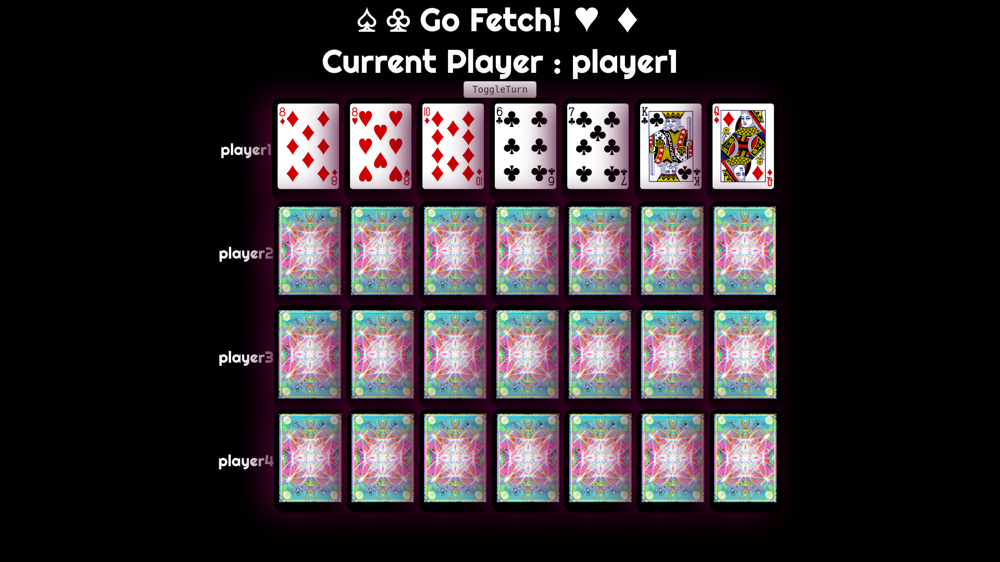

# GoFetch
a simple card game made with the deckofcardsapi.com api



## Install
Simply clone down this repo, change into the directory and run: 
``` npm install ```
``` npm start ```

## How to play
	The game starts on your turn. Click one of your cards and then click another    
	player to ask them for the card. If they have a match the card will be moved   
	into your hand.

## Technologies 
	This app uses react as a front end and deckofcardsapi.com for creating and managing    
	decks of cards.

## Contact
	[David Henderson](https://github.com/notdavidhenderson)
	[Jo Siciliano](https://github.com/joannsiciliano)